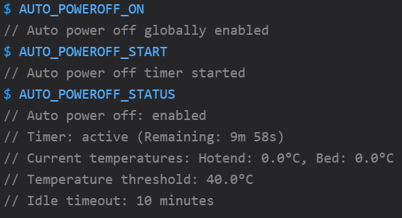

# Klipper Auto Power Off

A Klipper module that automatically powers off your 3D printer after a completed print, once it has cooled down and remained idle for a specified period of time.



## Features

- Automatically shut down your printer after completed prints
- Configurable idle timeout (default: 10 minutes)
- Configurable temperature threshold (default: 40°C)
- Integration with both Fluidd and Mainsail for easy control via UI
- Status monitoring for hotend and bed temperatures
- Manual control with GCODE commands
- Works with any GPIO-controlled power device
- Available in English and French
- Compatible with all Moonraker power device types (GPIO, TP-Link Smartplug, Tasmota, Shelly, etc.)
- Web interface focused: LCD menus have been removed for simplicity
- **New** - Enhanced error handling and diagnostic capabilities
- **New** - Improved network device support with robust connection testing
- **New** - Type-safe implementation with structured exceptions
- **New** - Fixed auto-update through Moonraker update manager

## Requirements

- Klipper with a properly configured [power GPIO control](https://www.klipper3d.org/Config_Reference.html#output_pin)
- Fluidd or Mainsail (for UI integration)
- A 3D printer with a power control setup

## Support Development

If you find this module useful, consider buying me a coffee to support further development!

[](https://www.buymeacoffee.com/jayceeB1)

Your support is greatly appreciated and helps keep this project maintained and improved!

## Important Update

As of the latest version, Auto Power Off works primarily through Moonraker's power control API. The module is now configured by default to use Moonraker integration, providing better compatibility with various power device types.

### Key Changes
- Moonraker integration is now enabled by default
- Configuration requires your device to be properly set up in Moonraker's config
- Improved reliability and compatibility with network-based power devices
- LCD menu entries have been removed to focus on web interface integration
- **New** - Structured type-safe code with enhanced error handling
- **New** - Better diagnostic tools for troubleshooting
- **New** - Improved updater integration with better error handling

## Installation

### Automatic Installation (Recommended)

1. Download the installation script:
   ```bash
   wget -O install.sh https://raw.githubusercontent.com/JayceeB1/klipper-auto-power-off/main/scripts/install.sh
   ```

2. Make it executable:
   ```bash
   chmod +x install.sh
   ```

3. Run the script:
   ```bash
   # Run with default language (English)
   ./install.sh

   # Or specify a language
   ./install.sh --en  # English
   ./install.sh --fr  # French
   ```

4. Follow the on-screen instructions.

### Manual Installation

1. Copy the `auto_power_off.py` script to your Klipper extras directory:
   ```bash
   cp src/auto_power_off.py ~/klipper/klippy/extras/
   ```

2. Copy the UI panel files based on your interface:
   
   **For Fluidd:**
   ```bash
   mkdir -p ~/printer_data/config/fluidd/
   # English version
   cp ui/fluidd/auto_power_off.cfg ~/printer_data/config/fluidd/
   # French version
   cp ui/fluidd/auto_power_off_fr.cfg ~/printer_data/config/fluidd/auto_power_off.cfg
   ```
   
   **For Mainsail:**
   ```bash
   mkdir -p ~/printer_data/config/mainsail/
   # English version
   cp ui/mainsail/auto_power_off.cfg ~/printer_data/config/mainsail/
   cp ui/mainsail/auto_power_off_panel.cfg ~/printer_data/config/mainsail/
   # French version
   cp ui/mainsail/auto_power_off_fr.cfg ~/printer_data/config/mainsail/
   cp ui/mainsail/auto_power_off_panel_fr.cfg ~/printer_data/config/mainsail/
   ```

3. Add the following to your `printer.cfg` file:
   ```
   [auto_power_off]
   idle_timeout: 600     # Idle time in seconds before power off (10 minutes)
   temp_threshold: 40    # Temperature threshold in °C (printer considered cool)
   power_device: psu_control  # Name of your power device (must match the [power] section)
   auto_poweroff_enabled: True  # Enable auto power off by default at startup

   # For Fluidd:
   [include fluidd/auto_power_off.cfg]
   
   # For Mainsail:
   [include mainsail/auto_power_off.cfg]
   ```

4. Add the following to your `moonraker.conf`file:
   ```
   [update_manager auto_power_off]
   type: git_repo
   path: ~/auto_power_off
   origin: https://github.com/JayceeB1/klipper-auto-power-off.git
   primary_branch: main
   install_script: scripts/install.sh
   managed_services: klipper
   ```

5. Restart Klipper:
   ```bash
   sudo systemctl restart klipper
   ```

## Auto-Update with Moonraker

Auto Power Off now supports automatic updates through Moonraker's update manager system. This allows you to update the module directly from the Fluidd or Mainsail interface, just like other components of your 3D printer firmware.

### Automatic Setup During Installation

When running the installation script, you'll be prompted to add the update manager configuration to your `moonraker.conf` file. This setup:

1. Creates a local Git repository for the module files
2. Adds the update manager configuration to `moonraker.conf`
3. Configures the repository to track updates from the main project

### Troubleshooting Update Manager Issues

If you encounter issues with the auto-update functionality showing errors like "Failed to detect repo url" or "Invalid path", follow these steps:

1. Run the installation script again:
   ```bash
   wget -O install.sh https://raw.githubusercontent.com/JayceeB1/klipper-auto-power-off/main/scripts/install.sh
   chmod +x install.sh
   ./install.sh
   ```

2. Choose "y" when asked about adding update manager configuration
3. The improved script will clean up old configurations and properly set up the git repository

### Manual Setup for Existing Installations

If you have an existing installation and want to add update manager support:

1. Run the installation script again:
   ```bash
   wget -O install.sh https://raw.githubusercontent.com/JayceeB1/klipper-auto-power-off/main/scripts/install.sh
   chmod +x install.sh
   ./install.sh
   ```

2. Choose "y" when asked about adding update manager configuration
3. You can specify a custom path for the local repository if needed

### Update Manager Configuration

The following configuration will be added to your `moonraker.conf`:

```ini
[update_manager auto_power_off]
type: git_repo
path: ~/auto_power_off
origin: https://github.com/JayceeB1/klipper-auto-power-off.git
primary_branch: main
install_script: scripts/install.sh
managed_services: klipper
```

### Updating via Fluidd/Mainsail

Once configured, you can update Auto Power Off directly from the Fluidd or Mainsail interface:

1. Go to the "Machine" or "System" tab
2. Look for "Auto Power Off" in the update section
3. Click "Update" when a new version is available

Updates will be applied automatically and Klipper will be restarted to load the updated module.


## Configuration

The following parameters can be configured in the `[auto_power_off]` section:

| Parameter | Default | Description |
|-----------|---------|-------------|
| `idle_timeout` | 600 | Time in seconds to wait before powering off (after print completed) |
| `temp_threshold` | 40 | Temperature in °C below which it's safe to power off. By default, monitors both the hotend and heated bed, and uses the highest temperature for comparison |
| `monitor_hotend` | True | Monitor hotend temperature for power off |
| `monitor_bed` | True | Monitor heated bed temperature for power off |
| `monitor_chamber` | False | Monitor chamber temperature for power off (if available) |
| `power_device` | psu_control | Name of your power device (must match the [power] section) |
| `auto_poweroff_enabled` | False | Enable auto power off by default at startup |
| `language` | auto | Language for messages: 'en' for English, 'fr' for French, 'auto' for auto-detection |
| `moonraker_integration` | True | Enable integration with Moonraker's power control |
| `moonraker_url` | http://localhost:7125 | URL for Moonraker API |
| `diagnostic_mode` | False | Enable detailed logging for troubleshooting power off issues |
| `power_off_retries` | 3 | Number of retry attempts when using Moonraker API |
| `power_off_retry_delay` | 2 | Delay in seconds between retry attempts |
| `dry_run_mode` | False | Simulate power off without actually powering off the printer (for testing) |
| `network_device` | False | Indicate if the power device is on the network |
| `device_address` | None | IP address or hostname of the network device |
| `network_test_attempts` | 3 | Number of attempts to test network device connectivity |
| `network_test_interval` | 1.0 | Interval in seconds between network connectivity test attempts |

## New Features in v2.0.3

### Improved Auto-Update Functionality

The latest version brings significant improvements to the update system:

- Fixed issues with the update manager integration
- Better error handling for repository setup
- Improved Git repository initialization
- Enhanced file tracking to prevent "untracked files" errors
- Ability to specify custom repository paths
- Automatic cleanup of old or incorrect configurations

### Enhanced Error Handling

The module now provides robust error handling with a structured exception hierarchy:

- Better error reporting for network connectivity issues
- Clear distinction between different types of errors (device, Moonraker API, network)
- Improved diagnostic logging for troubleshooting

### Type-Safe Implementation

- Full type annotations for better code maintainability
- Enumerations for states and methods for improved reliability
- Clean API for integrating with Klipper's ecosystem

### Advanced Network Device Support

- Comprehensive network device testing before power off attempts
- Configurable retry mechanism for unreliable network environments
- Improved fallback to direct methods when network devices are unreachable

### Improved Diagnostics

- Enhanced diagnostic mode with detailed logging
- Better reporting of device capabilities
- Clear status information through the user interface

### Multilingual Support Improvements

- More robust language detection and persistence
- Better handling of translation loading
- Clearer error messages in both English and French

## Troubleshooting

### Common Problems and Solutions

#### Update Manager Issues

If you see errors like "Failed to detect repo url" or "Invalid path" in your update manager:

1. Download and run the improved installation script
2. Choose "y" when asked to update Moonraker configuration
3. The script will properly set up the git repository and fix configuration issues

#### CURL-based implementation

The Auto Power Off module uses the CURL command for communication with the Moonraker API instead of Python libraries like requests or urllib. This improves compatibility and reliability, avoiding external dependency issues.

If you have problems communicating with Moonraker, check that the CURL command is available on your system:
```bash
which curl
```

If CURL is not installed, you can install it with:
```bash
sudo apt-get install curl
```

#### Testing with Dry Run Mode

To safely test the auto power off functionality without actually powering off your printer:

1. Enable dry run mode in your configuration: `dry_run_mode: True`
2. Or use the GCODE command: `AUTO_POWEROFF DRYRUN VALUE=1`
3. This will simulate power off and log all actions without actually powering off the printer

### Detailed Device Capability Diagnostics

To understand what capabilities your power device has:

1. Enable diagnostic mode: `AUTO_POWEROFF DIAGNOSTIC VALUE=1`
2. Check logs with: `tail -f /tmp/klippy.log | grep -i auto_power_off`
3. The logs will show what methods are available for your device
4. This helps troubleshoot why power off might not be working

## For Developers

### Code Structure

The refactored code now uses a more maintainable architecture:

- Structured exception hierarchy for better error handling
- Type annotations for improved IDE support and code safety
- Enumerations for states and methods for better code structure
- Clear separation of concerns in the codebase

### Contributing

Before submitting pull requests, make sure to:

1. Follow the type-safe coding style
2. Maintain backward compatibility
3. Update documentation for any new features
4. Test changes with various configurations

## License

This project is licensed under the GPL-3.0 License - see the [LICENSE](LICENSE) file for details.

## Acknowledgements

- Inspired by OctoPrint's PSU Control plugin
- Thanks to the Klipper, Fluidd, and Mainsail development teams