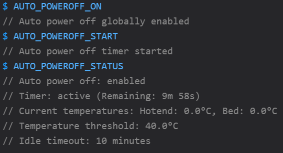

# Klipper Auto Power Off

A Klipper module that automatically powers off your 3D printer after a completed print, once it has cooled down and remained idle for a specified period of time.



## Features

- Automatically shut down your printer after completed prints
- Configurable idle timeout (default: 10 minutes)
- Configurable temperature threshold (default: 40°C)
- Integration with both Fluidd and Mainsail for easy control via UI
- Status monitoring for hotend and bed temperatures
- Manual control with GCODE commands
- Works with any GPIO-controlled power device
- Available in English and French
- Compatible with all Moonraker power device types (GPIO, TP-Link Smartplug, Tasmota, Shelly, etc.)
- Web interface focused: LCD menus have been removed for simplicity

## Documentation

For a better understanding of how Auto Power Off works internally, check out the [sequence diagrams](DIAGRAMS.md) that illustrate the various shutdown processes and component interactions.

## Requirements

- Klipper with a properly configured [power GPIO control](https://www.klipper3d.org/Config_Reference.html#output_pin)
- Fluidd or Mainsail (for UI integration)
- A 3D printer with a power control setup

## Support Development

If you find this module useful, consider buying me a coffee to support further development!

[](https://www.buymeacoffee.com/jayceeB1)

Your support is greatly appreciated and helps keep this project maintained and improved!

## Available Commands

The module provides the following GCODE commands:

Klipper rejects bare parameters, so use either the `OPTION=` form or the
dedicated aliases (the UI macros in `ui/fluidd/` and `ui/mainsail/` call
them for you):

- `AUTO_POWEROFF OPTION=ON` - Globally enable the function
- `AUTO_POWEROFF OPTION=OFF` - Globally disable the function
- `AUTO_POWEROFF OPTION=START` - Manually start the timer
- `AUTO_POWEROFF OPTION=CANCEL` - Cancel the current timer
- `AUTO_POWEROFF OPTION=NOW` - Immediately power off the printer
- `AUTO_POWEROFF OPTION=STATUS` - Display detailed status
- `AUTO_POWEROFF_DIAGNOSTIC VALUE=1` - Enable diagnostic mode (0 to disable)
- `AUTO_POWEROFF_DRYRUN VALUE=1` - Enable dry-run mode (0 to disable)
- `AUTO_POWEROFF_RESET` - Force reset of the module's internal state
- `AUTO_POWEROFF_VERSION` - Print the currently loaded module version

## Key Features

The module offers several advanced features:

- **Intelligent Power Management**: Powers off only when temperatures are safe and printer is idle
- **Multi-UI Integration**: Full integration with both Fluidd and Mainsail interfaces
- **Network Device Support**: Works with various network-connected power devices
- **Diagnostics & Troubleshooting**: Diagnostic mode for detailed logs and operation tracing
- **Moonraker Integration**: Leverages Moonraker's power control API for better compatibility
- **Type-Safe Implementation**: Robust error handling with structured exception hierarchy
- **Multilingual Support**: Full English and French language support
- **Seamless Updates**: Integrates with Moonraker's update manager for easy updates

For a detailed list of changes between versions, please refer to the [CHANGELOG.md](CHANGELOG.md) file.

## Installation

### Automatic Installation (Recommended)

1. Download the installation script:
   ```bash
   wget -O install.sh https://raw.githubusercontent.com/JayceeB1/klipper-auto-power-off/main/scripts/install.sh
   ```

2. Make it executable:
   ```bash
   chmod +x install.sh
   ```

3. Run the script:
   ```bash
   # Run with default language (English)
   ./install.sh

   # Or specify a language
   ./install.sh --en  # English
   ./install.sh --fr  # French
   ```

4. Follow the on-screen instructions.

### Manual Installation

1. Copy the `auto_power_off.py` script to your Klipper extras directory:
   ```bash
   cp src/auto_power_off.py ~/klipper/klippy/extras/
   ```

2. Copy the UI panel files based on your interface:
   
   **For Fluidd:**
   ```bash
   mkdir -p ~/printer_data/config/fluidd/
   # English version
   cp ui/fluidd/auto_power_off.cfg ~/printer_data/config/fluidd/
   # French version
   cp ui/fluidd/auto_power_off_fr.cfg ~/printer_data/config/fluidd/auto_power_off.cfg
   ```
   
   **For Mainsail:**
   ```bash
   mkdir -p ~/printer_data/config/mainsail/
   # English version
   cp ui/mainsail/auto_power_off.cfg ~/printer_data/config/mainsail/
   cp ui/mainsail/auto_power_off_panel.cfg ~/printer_data/config/mainsail/
   # French version
   cp ui/mainsail/auto_power_off_fr.cfg ~/printer_data/config/mainsail/
   cp ui/mainsail/auto_power_off_panel_fr.cfg ~/printer_data/config/mainsail/
   ```

3. Add the following to your `printer.cfg` file:
   ```
   [auto_power_off]
   idle_timeout: 600     # Idle time in seconds before power off (10 minutes)
   temp_threshold: 40    # Temperature threshold in °C (printer considered cool)
   power_device: psu_control  # Name of your power device (must match the [power] section)
   auto_poweroff_enabled: True  # Enable auto power off by default at startup

   # For Fluidd:
   [include fluidd/auto_power_off.cfg]
   
   # For Mainsail:
   [include mainsail/auto_power_off.cfg]
   ```

4. Add the following to your `moonraker.conf`file:
   ```
   [update_manager auto_power_off]
   type: git_repo
   path: ~/auto_power_off
   origin: https://github.com/JayceeB1/Klipper-Auto-Power-Off.git
   primary_branch: main
   install_script: scripts/install.sh
   ```

5. Restart Klipper:
   ```bash
   sudo systemctl restart klipper
   ```

## Auto-Update with Moonraker

Auto Power Off now supports automatic updates through Moonraker's update manager system. This allows you to update the module directly from the Fluidd or Mainsail interface, just like other components of your 3D printer firmware.

### Automatic Setup During Installation

When running the installation script, you'll be prompted to add the update manager configuration to your `moonraker.conf` file. This setup:

1. Creates a local Git repository for the module files
2. Adds the update manager configuration to `moonraker.conf`
3. Configures the repository to track updates from the main project

### Troubleshooting Update Manager Issues

If you encounter issues with the auto-update functionality showing errors like "Failed to detect repo url" or "Invalid path", follow these steps:

1. Run the installation script again:
   ```bash
   wget -O install.sh https://raw.githubusercontent.com/JayceeB1/klipper-auto-power-off/main/scripts/install.sh
   chmod +x install.sh
   ./install.sh
   ```

2. Choose "y" when asked about adding update manager configuration
3. The improved script will clean up old configurations and properly set up the git repository

### Manual Setup for Existing Installations

If you have an existing installation and want to add update manager support:

1. Run the installation script again:
   ```bash
   wget -O install.sh https://raw.githubusercontent.com/JayceeB1/klipper-auto-power-off/main/scripts/install.sh
   chmod +x install.sh
   ./install.sh
   ```

2. Choose "y" when asked about adding update manager configuration
3. You can specify a custom path for the local repository if needed

### Update Manager Configuration

The following configuration (or similar) will be added to your `moonraker.conf`:

```ini
[update_manager auto_power_off]
type: git_repo
path: ~/auto_power_off    # This path may vary according to your installation
origin: https://github.com/JayceeB1/Klipper-Auto-Power-Off.git
primary_branch: main
install_script: scripts/install.sh
```

Note: The installation script will detect or prompt you for the appropriate path for your system. The path may vary based on your user account and preferences (e.g., `/home/username/auto_power_off`). The script will ensure the correct path is used in your configuration.

### Updating via Fluidd/Mainsail

Once configured, you can update Auto Power Off directly from the Fluidd or Mainsail interface:

1. Go to the "Machine" or "System" tab
2. Look for "Auto Power Off" in the update section
3. Click "Update" when a new version is available

Updates will be applied automatically and Klipper will be restarted to load the updated module.


## Configuration

The following parameters can be configured in the `[auto_power_off]` section:

| Parameter | Default | Description |
|-----------|---------|-------------|
| `idle_timeout` | 600 | Time in seconds to wait before powering off (after print completed) |
| `temp_threshold` | 40 | Temperature in °C below which it's safe to power off. By default, monitors both the hotend and heated bed, and uses the highest temperature for comparison |
| `monitor_hotend` | True | Monitor hotend temperature for power off |
| `monitor_bed` | True | Monitor heated bed temperature for power off |
| `monitor_chamber` | False | Monitor chamber temperature for power off (if available) |
| `power_device` | psu_control | Name of your power device (must match the [power] section) |
| `auto_poweroff_enabled` | False | Enable auto power off by default at startup |
| `language` | auto | Language for messages: 'en' for English, 'fr' for French, 'auto' for auto-detection |
| `moonraker_integration` | True | Enable integration with Moonraker's power control |
| `moonraker_url` | http://localhost:7125 | URL for Moonraker API |
| `diagnostic_mode` | False | Enable detailed logging for troubleshooting power off issues |
| `power_off_retries` | 3 | Number of retry attempts when using Moonraker API |
| `power_off_retry_delay` | 2 | Delay in seconds between retry attempts |
| `dry_run_mode` | False | Simulate power off without actually powering off the printer (for testing) |
| `network_device` | False | Indicate if the power device is on the network |
| `device_address` | None | IP address or hostname of the network device |
| `network_test_attempts` | 3 | Number of attempts to test network device connectivity |
| `network_test_interval` | 1.0 | Interval in seconds between network connectivity test attempts |

## Power Device Examples

### Tasmota Smart Plug

To control your printer via a Tasmota device, add a `[power]` section to `moonraker.conf`:

```ini
# moonraker.conf
[power printer_plug]
type: tasmota
address: 192.168.1.xxx      # IP address of your Tasmota device
# password: your_password   # Uncomment if you set a Tasmota password
# output_id: 1              # Uncomment for multi-relay Tasmota devices
```

Then reference that device name in `printer.cfg`:

```ini
[auto_power_off]
power_device: printer_plug  # Must match the name in [power printer_plug]
idle_timeout: 600
temp_threshold: 40
auto_poweroff_enabled: True
moonraker_integration: True
moonraker_url: http://localhost:7125
```

> **Note:** The `[power]` section is a **Moonraker** configuration block (goes in `moonraker.conf`), not a Klipper block. Auto Power Off calls the Moonraker API to flip the switch when conditions are met.

### Tasmota + Raspberry Pi Sequential Shutdown

A common setup is having the RPi and the printer on the **same** Tasmota outlet. Cutting power via the module would kill the RPi immediately (unclean shutdown).

**Recommended approach — separate outlets:**

Put the RPi on a permanent power source (or a second, always-on Tasmota outlet) and the printer on the outlet controlled by Auto Power Off. The RPi stays alive; only the printer loses power.

```ini
# moonraker.conf — controls only the printer's outlet
[power printer_plug]
type: tasmota
address: 192.168.1.xxx
```

**Alternative — same outlet, clean shutdown first:**

If you must put both on the same outlet, use Moonraker's `bound_service` so that Moonraker gracefully shuts down Klipper (and the RPi) before the outlet is cut. Configure a Klipper macro to trigger a host shutdown, then let the Tasmota outlet cut power after the RPi has fully powered off:

```gcode
# In printer.cfg — add to your END_PRINT or trigger manually
[gcode_macro SHUTDOWN_HOST_THEN_PRINTER]
gcode:
    AUTO_POWEROFF OPTION=START   # start the idle/cooling countdown
    # Once the countdown fires, Moonraker will call /machine/device_power/device
    # to turn off the outlet. To also shut down the RPi cleanly beforehand,
    # add this line — it triggers an OS-level shutdown 60 s before outlet cut:
    {action_call_remote_method("shutdown_machine")}
```

> `action_call_remote_method("shutdown_machine")` asks Moonraker to shut down the host OS. Call it before the outlet is cut so the RPi has time to power off cleanly. There is no built-in per-device delay in Auto Power Off; for a fixed 2-minute cooling delay before the outlet cuts, set `idle_timeout: 120` in `[auto_power_off]` and call `AUTO_POWEROFF OPTION=START` at the end of your print.

### Troubleshooting Update Manager "Repo has diverged from remote"

Versions before 2.1.0 created a local git commit inside `~/auto_power_off` during installation. This commit does not exist in the GitHub history, so Moonraker's update manager reports "diverged from remote" and refuses to update.

**One-time fix:**
```bash
cd ~/auto_power_off
git fetch origin
git reset --hard origin/main
```

After that, re-run the installer once to restore any local files that were only in the diverged commit:
```bash
wget -O install.sh https://raw.githubusercontent.com/JayceeB1/klipper-auto-power-off/main/scripts/install.sh
chmod +x install.sh
./install.sh
```

Version 2.1.0+ never creates local commits, so the problem will not recur.

## Uninstallation

To completely uninstall the Auto Power Off module, an uninstallation script is now available:

### Automatic Uninstallation

1. Download the uninstallation script:
   ```bash
   wget -O uninstall.sh https://raw.githubusercontent.com/JayceeB1/Klipper-Auto-Power-Off/main/scripts/uninstall.sh
   ```

2. Make it executable:
   ```bash
   chmod +x uninstall.sh
   ```

3. Run the script:
   ```bash
   # Run with default language (English)
   ./uninstall.sh

   # Or specify a language
   ./uninstall.sh --en  # English
   ./uninstall.sh --fr  # French
   ```

4. Follow the on-screen instructions.

The script will automatically perform the following actions:
- Remove the Python module and translation files
- Remove the UI configuration files for Fluidd and Mainsail
- Clean up modifications in printer.cfg
- Remove the update manager configuration in moonraker.conf
- Remove the local Git repository created for updates
- Create backups of all modified configuration files

### Advanced Options

- `--force`: Run the uninstallation without asking for confirmation
- `--fr` or `--en`: Specify the language for messages (French or English)

### Manual Uninstallation

If you prefer to uninstall manually, follow these steps:

1. Remove the Python module:
   ```bash
   rm ~/klipper/klippy/extras/auto_power_off.py
   rm -r ~/klipper/klippy/extras/auto_power_off_langs
   ```

2. Remove the configuration files:
   ```bash
   # For Fluidd
   rm ~/printer_data/config/fluidd/auto_power_off*.cfg
   
   # For Mainsail
   rm ~/printer_data/config/mainsail/auto_power_off*.cfg
   rm ~/printer_data/config/mainsail/auto_power_off_panel*.cfg
   ```

3. Edit your `printer.cfg` file to remove the sections related to Auto Power Off.

4. Edit your `moonraker.conf` file to remove the `[update_manager auto_power_off]` section.

5. Remove the local Git repository (usually `~/auto_power_off`).

6. Restart Klipper and Moonraker:
   ```bash
   sudo systemctl restart klipper
   sudo systemctl restart moonraker
   ```

## Advanced Usage

### Opt-in Power-Off (don't auto-poweroff every print)

By default, `AUTO_POWEROFF OPTION=START` inside `END_PRINT` causes the printer to power off after **every** print. If you run sequential prints you probably don't want that — you'd rather decide *before* a print whether the machine should shut down afterwards.

The pattern below (contributed by community member @thaala) uses a single boolean variable to control this:

```gcode
# In printer.cfg

[gcode_macro POW_WANTED]
description: Flag: power off after the next print
variable_powwanted: 0
gcode:
  SET_GCODE_VARIABLE MACRO=POW_WANTED VARIABLE=powwanted VALUE=1

[gcode_macro POW_UNWANTED]
description: Clear the flag and cancel any running countdown
gcode:
  SET_GCODE_VARIABLE MACRO=POW_WANTED VARIABLE=powwanted VALUE=0
  AUTO_POWEROFF OPTION=CANCEL

[gcode_macro POWEROFF_IF_WANTED]
description: Start the auto-poweroff timer only if POW_WANTED was set
gcode:
  
    AUTO_POWEROFF OPTION=START
  
```

Then wire it into your print macros:

```gcode
[gcode_macro PRINT_START]
gcode:
  POW_UNWANTED          # always clear the flag at print start
  # ... rest of your start routine ...

[gcode_macro END_PRINT]
gcode:
  # ... your existing end routine ...
  M104 S0
  M140 S0
  POWEROFF_IF_WANTED    # only starts timer if you called POW_WANTED before this print

[gcode_macro CANCEL_PRINT]
gcode:
  # ... your existing cancel routine ...
  POW_UNWANTED          # cancel power-off on manual cancels too
```

Usage: before starting a print you want to be the last one, run `POW_WANTED` from the Mainsail/Fluidd console or a UI macro button. All other prints complete normally without powering off.

## Troubleshooting

### Common Problems and Solutions

#### Timer doesn't start after a print finishes

The module listens for Klipper's `print_stats:complete` event. That event
is only emitted when `[print_stats]` (or `[virtual_sdcard]`, which pulls it
in) cleanly marks the print as `complete`. If your slicer end G-code or
your `END_PRINT` macro doesn't yield that transition, the timer won't
start automatically.

The most reliable fix is to call `AUTO_POWEROFF OPTION=START` explicitly
at the end of your `END_PRINT` (and optionally `CANCEL_PRINT`) macro:

```gcode
[gcode_macro END_PRINT]
gcode:
    # ... your existing end routine ...
    M104 S0
    M140 S0
    AUTO_POWEROFF OPTION=START
```

Verify the auto-start works manually with `AUTO_POWEROFF OPTION=START`
(or the `AUTO_POWEROFF_START` / `POWEROFF_START` macro depending on your
UI). If that works but the automatic trigger doesn't, the event isn't
reaching the module and the `END_PRINT` workaround is the supported
path.

#### Module State Reset

If your power device has been manually turned back on after an automatic power off and you encounter issues with subsequent power off commands, you can use the `AUTO_POWEROFF_RESET` command to force a reset of the module's internal state:

```gcode
AUTO_POWEROFF_RESET
```

This is particularly useful when:
- The module fails to detect that the printer has been manually powered back on
- Commands like `AUTO_POWEROFF NOW` no longer work after a manual power-on
- The system is in an inconsistent state after a network or communication interruption

#### Update Manager Issues

If you see errors like "Failed to detect repo url" or "Invalid path" in your update manager:

1. Download and run the improved installation script
2. Choose "y" when asked to update Moonraker configuration
3. The script will properly set up the git repository and fix configuration issues

#### CURL-based implementation

The Auto Power Off module uses the CURL command for communication with the Moonraker API instead of Python libraries like requests or urllib. This improves compatibility and reliability, avoiding external dependency issues.

If you have problems communicating with Moonraker, check that the CURL command is available on your system:
```bash
which curl
```

If CURL is not installed, you can install it with:
```bash
sudo apt-get install curl
```

#### Testing with Dry Run Mode

To safely test the auto power off functionality without actually powering off your printer:

1. Enable dry run mode in your configuration: `dry_run_mode: True`
2. Or use the GCODE command: `AUTO_POWEROFF DRYRUN VALUE=1`
3. This will simulate power off and log all actions without actually powering off the printer

### Detailed Device Capability Diagnostics

To understand what capabilities your power device has:

1. Enable diagnostic mode: `AUTO_POWEROFF_DIAGNOSTIC VALUE=1`
2. Check logs with: `tail -f /tmp/klippy.log | grep -i auto_power_off`
3. The logs will show what methods are available for your device
4. This helps troubleshoot why power off might not be working

## For Developers

### Code Structure

The refactored code now uses a more maintainable architecture:

- Structured exception hierarchy for better error handling
- Type annotations for improved IDE support and code safety
- Enumerations for states and methods for better code structure
- Clear separation of concerns in the codebase

### Contributing

Before submitting pull requests, make sure to:

1. Follow the type-safe coding style
2. Maintain backward compatibility
3. Update documentation for any new features
4. Test changes with various configurations

## License

This project is licensed under the GPL-3.0 License - see the [LICENSE](LICENSE) file for details.

## Acknowledgements

- Inspired by OctoPrint's PSU Control plugin
- Thanks to the Klipper, Fluidd, and Mainsail development teams